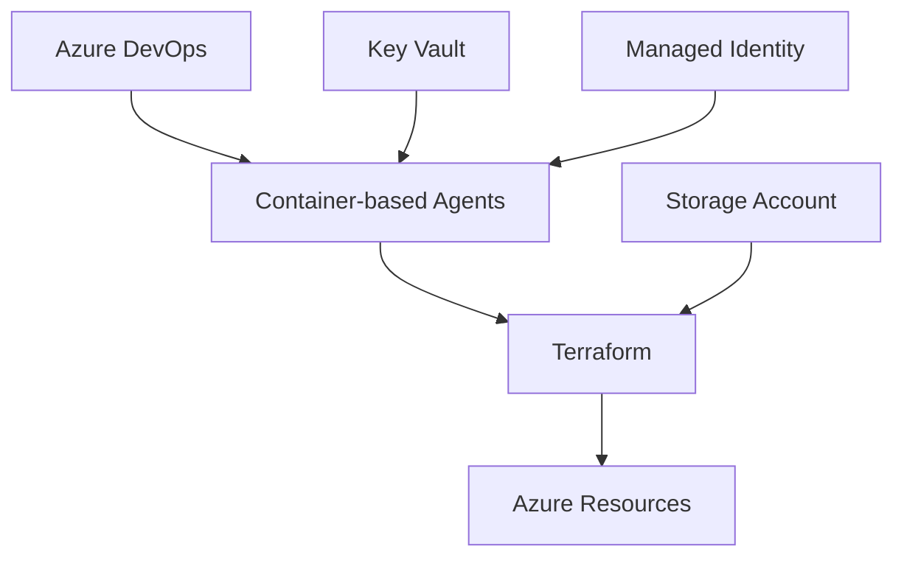

````markdown
# Automation

## Introduction

This section provides comprehensive instructions for automating the deployment of the AKS Secure Baseline infrastructure using Azure DevOps Pipelines and Terraform. Our approach follows Azure best practices with Infrastructure as Code (IaC), GitOps workflows, and modern container-based build agents.

## Architecture Overview



## Prerequisites

Before starting, ensure you have:
- Azure subscription with Contributor access
- Azure DevOps organization access
- Azure CLI (version 2.50.0 or later)
- Basic understanding of Terraform and YAML pipelines

## Terraform Structure

The repository contains modular Terraform configurations:

```
terraform/
├── main.tf                 # Main orchestration file
├── variables.tf           # Variable definitions
├── outputs.tf            # Output values
└── modules/              # Reusable modules
    ├── aks/             # AKS cluster configuration
    ├── networking/      # Virtual network setup
    ├── security/        # Security components
    └── monitoring/      # Observability setup
```

Each module follows Azure best practices for:
- Resource naming conventions
- Network isolation
- Security hardening
- Cost optimization

## Azure DevOps Setup

### 1. Create Service Connection (Best Practice Method)

Instead of using Owner permissions, we'll create a service connection with minimal required permissions:

#### Step 1: Create Service Principal with Least Privilege

```bash
# Set variables
SUBSCRIPTION_ID=$(az account show --query id -o tsv)
SP_NAME="sp-aks-baseline-$(date +%s)"
RESOURCE_GROUP="rg-aks-baseline"

# Create Service Principal with Contributor role scoped to resource group
SP_CREDENTIALS=$(az ad sp create-for-rbac \
  --name $SP_NAME \
  --role "Contributor" \
  --scopes "/subscriptions/$SUBSCRIPTION_ID/resourceGroups/$RESOURCE_GROUP" \
  --sdk-auth)

# Extract values
CLIENT_ID=$(echo $SP_CREDENTIALS | jq -r .clientId)
CLIENT_SECRET=$(echo $SP_CREDENTIALS | jq -r .clientSecret)
TENANT_ID=$(echo $SP_CREDENTIALS | jq -r .tenantId)

# Grant additional required permissions
# AKS cluster admin
az role assignment create \
  --assignee $CLIENT_ID \
  --role "Azure Kubernetes Service Cluster Admin Role" \
  --scope "/subscriptions/$SUBSCRIPTION_ID/resourceGroups/$RESOURCE_GROUP"

# Key Vault Secrets Officer (for secret management)
az role assignment create \
  --assignee $CLIENT_ID \
  --role "Key Vault Secrets Officer" \
  --scope "/subscriptions/$SUBSCRIPTION_ID/resourceGroups/$RESOURCE_GROUP"

# Network Contributor (for VNET operations)
az role assignment create \
  --assignee $CLIENT_ID \
  --role "Network Contributor" \
  --scope "/subscriptions/$SUBSCRIPTION_ID/resourceGroups/$RESOURCE_GROUP"

# User Access Administrator (for managed identity assignments)
az role assignment create \
  --assignee $CLIENT_ID \
  --role "User Access Administrator" \
  --scope "/subscriptions/$SUBSCRIPTION_ID/resourceGroups/$RESOURCE_GROUP"

echo "Service Principal created successfully"
echo "Client ID: $CLIENT_ID"
echo "Save the credentials securely"
```

#### Step 2: Create Service Connection in Azure DevOps

1. Navigate to **Project Settings** → **Service connections**
2. Click **New service connection** → **Azure Resource Manager**
3. Select **Service principal (manual)**
4. Fill in the details:
   - **Connection name**: `azure-aks-baseline-connection`
   - **Subscription Id**: Your Azure subscription ID
   - **Subscription Name**: Your subscription name
   - **Service Principal Id**: The CLIENT_ID from above
   - **Service principal key**: The CLIENT_SECRET from above
   - **Tenant ID**: The TENANT_ID from above
5. Click **Verify** to test the connection
6. Check **Grant access permission to all pipelines** (or configure per-pipeline)
7. Click **Verify and save**

### 2. Modern Build Agent Setup (Container-based)


#### Option A: Azure Container Instances (Recommended)

```bash
# Deploy container-based agents using the build-agent module
cd terraform/modules/build-agent

# Create tfvars file
cat > agent.tfvars <<EOF
name                = "aks-baseline-agents"
resource_group_name = "rg-build-agents"
location            = "westeurope"
environment         = "production"
azdo_org_url       = "https://dev.azure.com/YOUR_ORG"
azdo_pool_name     = "Container-Pool"
agent_count        = 2
agent_cpu          = 2
agent_memory       = 4
use_container_instances = true
EOF

# Deploy
terraform init
terraform plan -var-file="agent.tfvars" -var="azdo_pat_token=$PAT_TOKEN"
terraform apply -var-file="agent.tfvars" -var="azdo_pat_token=$PAT_TOKEN"
```

#### Option B: Azure Kubernetes Service (For existing AKS clusters)

```yaml
# kube-agent-deployment.yaml
apiVersion: apps/v1
kind: Deployment
metadata:
  name: azdo-agent
  namespace: build-agents
spec:
  replicas: 2
  selector:
    matchLabels:
      app: azdo-agent
  template:
    metadata:
      labels:
        app: azdo-agent
    spec:
      serviceAccountName: azdo-agent
      containers:
      - name: agent
        image: mcr.microsoft.com/azure-pipelines/vsts-agent:ubuntu-20.04
        env:
        - name: AZP_URL
          value: "https://dev.azure.com/YOUR_ORG"
        - name: AZP_POOL
          value: "Kubernetes-Pool"
        - name: AZP_TOKEN
          valueFrom:
            secretKeyRef:
              name: azdo-pat
              key: token
        - name: AZP_AGENT_NAME
          valueFrom:
            fieldRef:
              fieldPath: metadata.name
        resources:
          requests:
            memory: "2Gi"
            cpu: "1"
          limits:
            memory: "4Gi"
            cpu: "2"
```

### 3. Terraform Backend Configuration

Set up a secure backend for state management:

```bash
# Create backend resources
BACKEND_RG="rg-terraform-backend"
BACKEND_STORAGE="stterraform$RANDOM"
BACKEND_CONTAINER="tfstate"

# Create resource group
az group create --name $BACKEND_RG --location westeurope

# Create storage account with security features
az storage account create \
  --name $BACKEND_STORAGE \
  --resource-group $BACKEND_RG \
  --location westeurope \
  --sku Standard_GRS \
  --encryption-services blob \
  --https-only true \
  --min-tls-version TLS1_2 \
  --allow-blob-public-access false

# Enable soft delete and versioning
az storage account blob-service-properties update \
  --account-name $BACKEND_STORAGE \
  --resource-group $BACKEND_RG \
  --enable-versioning true \
  --enable-delete-retention true \
  --delete-retention-days 30

# Create container
az storage container create \
  --name $BACKEND_CONTAINER \
  --account-name $BACKEND_STORAGE \
  --auth-mode login

# Create containers for each environment
for env in dev staging production; do
  az storage container create \
    --name "tfstate-$env" \
    --account-name $BACKEND_STORAGE \
    --auth-mode login
done

# Output configuration
echo "Backend configuration:"
echo "resource_group_name  = \"$BACKEND_RG\""
echo "storage_account_name = \"$BACKEND_STORAGE\""
echo "container_name       = \"tfstate-{environment}\""
echo "key                  = \"{environment}.tfstate\""
```

### 4. Import Repository

1. Go to **Repos** in Azure DevOps
2. Select **Import repository**
3. Enter the clone URL: `https://github.com/pelithne/AKS_Baseline_Deepdive.git`
4. Click **Import**

### 5. Create Pipeline with Multi-Stage Deployment

Instead of a single-stage pipeline, use our multi-stage approach:

1. Go to **Pipelines** → **New pipeline**
2. Select **Azure Repos Git**
3. Choose your imported repository
4. Select **Existing Azure Pipelines YAML file**
5. Choose: `/pipelines/azure-infrastructure-pipeline.yml`

### 6. Configure Pipeline Variables

#### Create Variable Groups

1. Go to **Pipelines** → **Library**
2. Create a new variable group: `terraform-common`

```yaml
# Common variables
TerraformVersion: 1.6.0
TerraformBackendResourceGroup: rg-terraform-backend
TerraformBackendStorageAccount: <your-storage-account>
```

3. Create environment-specific groups: `terraform-dev`, `terraform-staging`, `terraform-production`

```yaml
# Environment-specific variables
Environment: dev
AksClusterName: aks-baseline-dev
ResourceGroupName: rg-aks-baseline-dev
NodeResourceGroupName: rg-aks-nodes-dev
```

#### Secure Variables

For sensitive values, use Azure Key Vault:

```bash
# Create Key Vault
KV_NAME="kv-aks-baseline-$RANDOM"
az keyvault create \
  --name $KV_NAME \
  --resource-group $BACKEND_RG \
  --location westeurope \
  --enable-rbac-authorization

# Add secrets
az keyvault secret set --vault-name $KV_NAME --name "ssh-public-key" --value "$(cat ~/.ssh/id_rsa.pub)"
az keyvault secret set --vault-name $KV_NAME --name "azdo-pat" --value "<your-pat>"

# Link Key Vault to Variable Group
# In Azure DevOps: Library → Variable Group → Link secrets from Azure Key Vault
```

### 7. Pipeline Execution

Our multi-stage pipeline includes:

1. **Validation Stage**: Syntax checking, security scanning
2. **Plan Stage**: Terraform plan with manual review
3. **Deploy Stage**: Controlled deployment with approval gates
4. **Test Stage**: Automated testing of deployed resources

To run:
1. Click **Run pipeline**
2. Select parameters:
   - Environment: `dev`, `staging`, or `production`
   - Action: `plan` or `apply`
3. Review the plan output
4. Approve deployment (for staging/production)

## Security Best Practices Implemented

1. **Least Privilege Access**: Service principals have minimal required permissions
2. **Managed Identities**: Used wherever possible instead of service principals
3. **Key Vault Integration**: All secrets stored in Azure Key Vault
4. **Network Isolation**: Agents run in isolated networks
5. **Audit Logging**: All actions logged and traceable

## Cost Optimization

1. **Container-based Agents**: Pay only for active pipeline runs
2. **Spot Instances**: Used for non-production workloads
3. **Auto-scaling**: Agents scale based on queue depth
4. **Scheduled Deletion**: Dev resources deleted outside business hours

## Troubleshooting

### Common Issues and Solutions

1. **Service Connection Errors**
   ```bash
   # Verify service principal permissions
   az role assignment list --assignee <CLIENT_ID> --output table
   ```

2. **State Lock Issues**
   ```bash
   # Break lock if needed (use cautiously)
   terraform force-unlock <LOCK_ID>
   ```

3. **Agent Connection Issues**
   ```bash
   # Check agent logs
   kubectl logs -n build-agents -l app=azdo-agent
   ```

## Additional Resources

- [Azure DevOps Security Best Practices](https://docs.microsoft.com/en-us/azure/devops/organizations/security/security-best-practices)
- [Terraform Azure Provider Documentation](https://registry.terraform.io/providers/hashicorp/azurerm/latest)
- [AKS Baseline Reference Architecture](https://docs.microsoft.com/en-us/azure/architecture/reference-architectures/containers/aks/secure-baseline-aks)
````
