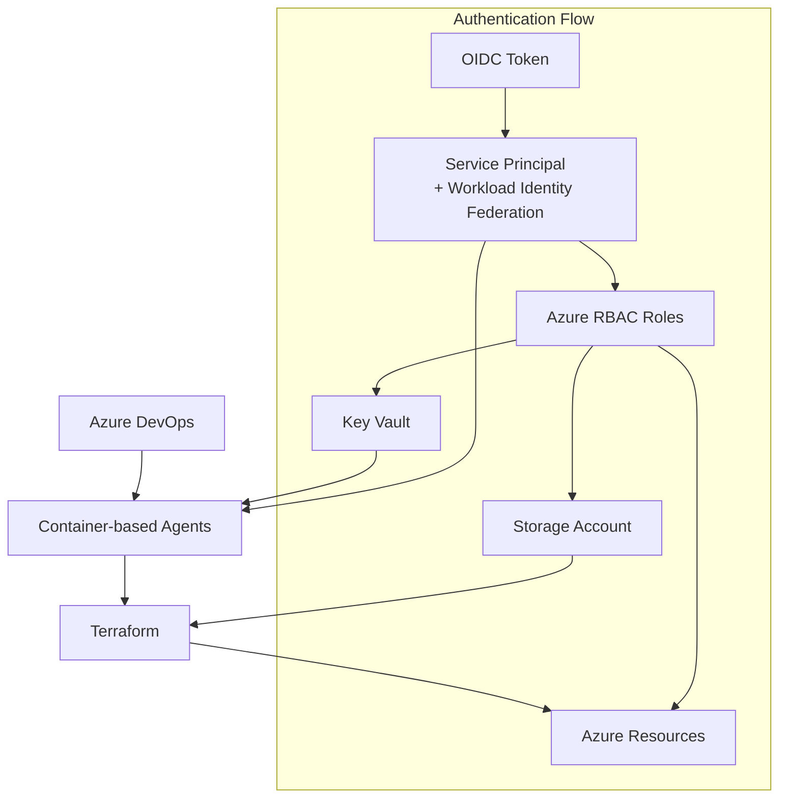

# AKS Baseline Automation with Azure DevOps

## Overview

This guide provides step-by-step instructions to automate the AKS Secure Baseline infrastructure deployment using Azure DevOps, Terraform, and Workload Identity Federation.

## Architecture



## Authentication Architecture Explained

**Important Clarification:** The authentication uses a **Service Principal with Workload Identity Federation**, not a traditional managed identity.

### How it works:

1. **Service Principal**: Created in Step 4, this is the identity that has RBAC permissions to deploy Azure resources
2. **Workload Identity Federation**: Azure DevOps authenticates to Azure using OIDC tokens (no client secrets)
3. **Container Agents**: The build agents run in containers but authenticate using the Service Principal credentials
4. **RBAC Permissions**: The Service Principal has Contributor, Storage Blob Data Contributor, and Key Vault Secrets Officer roles

### Authentication Flow:
```
Azure DevOps Pipeline → OIDC Token → Service Principal → Azure RBAC → Deploy Resources
```

This approach provides:
- **No stored secrets** (Workload Identity Federation uses OIDC)
- **Least privilege access** (Service Principal has specific RBAC roles)
- **Secure authentication** (Token-based authentication with Azure AD)

## Prerequisites

- Azure subscription with Owner or Contributor access
- Azure DevOps organization with Project Administrator permissions
- Azure CLI (version 2.50.0 or later)
- Git client
- WSL or Linux terminal
- Terraform (version 1.3 or later)

## Step 0: Deploy Build Agent Infrastructure

**Important:** Deploy the container-based build agents before setting up the pipeline.

### Create Azure DevOps Personal Access Token

1. **Navigate to Azure DevOps:**
   - Go to your Azure DevOps organization
   - Click on **User Settings** → **Personal access tokens**

2. **Create new token:**
   - Click **New Token**
   - **Name**: `Build Agent Token`
   - **Scopes**: Select **Agent Pools (read, manage)**
   - **Expiration**: Set appropriate expiration
   - Copy the token securely

### Deploy Build Agent Infrastructure

**Navigate to build-agent directory:**
```bash
cd build-agent
```

**Create terraform.tfvars file:**
```bash
# Copy the example file
cp terraform.tfvars.example terraform.tfvars

# Edit with your values
cat > terraform.tfvars << EOF
name                = "aks-baseline"
resource_group_name = "rg-aks-baseline-agents"
location           = "westeurope"
environment        = "production"
azdo_org_url       = "https://dev.azure.com/YOUR_ORG_NAME"
azdo_pool_name     = "aks-baseline-agents"
use_container_instances = true
agent_count            = 2
agent_cpu              = 2
agent_memory           = 4
tags = {
  Environment = "production"
  Project     = "aks-baseline"
  Purpose     = "build-agents"
}
EOF
```

**Set Azure DevOps PAT token:**
```bash
# Set as environment variable (recommended)
export TF_VAR_azdo_pat_token="YOUR_PAT_TOKEN_HERE"

# Or add to terraform.tfvars (less secure)
echo 'azdo_pat_token = "YOUR_PAT_TOKEN_HERE"' >> terraform.tfvars
```

**Set Azure context:**
```bash
# Get tenant ID and set required variables
export TF_VAR_tenant_id=$(az account show --query tenantId -o tsv)
export TF_VAR_resource_group_id="/subscriptions/$(az account show --query id -o tsv)/resourceGroups/rg-aks-baseline-agents"
```

**Create resource group:**
```bash
# Create resource group for build agents
az group create \
  --name "rg-aks-baseline-agents" \
  --location "westeurope"
```

**Deploy build agent infrastructure:**
```bash
# Initialize Terraform
terraform init

# Plan the deployment
terraform plan

# Apply the configuration
terraform apply
```

**Verify deployment:**
```bash
# Check that agents are registered in Azure DevOps
echo "Check your Azure DevOps organization:"
echo "Go to Project Settings → Agent pools → aks-baseline-agents"
echo "You should see 2 online agents"
```

## Repository Structure

The Terraform configuration is organized as follows:

```
terraform/
├── main.tf                 # Main configuration
├── variables.tf           # Input variables
├── backend.conf          # Backend configuration
└── modules/              # Reusable modules (16 modules)
    ├── aks/                    # AKS cluster
    ├── application_gateway/    # Application Gateway
    ├── bastion_host/          # Bastion host
    ├── container_registry/    # Azure Container Registry
    ├── firewall/              # Azure Firewall
    ├── key_vault/             # Key Vault
    ├── log_analytics/         # Log Analytics workspace
    ├── node_pool/             # AKS node pools
    ├── private_dns_zone/      # Private DNS zones
    ├── private_endpoint/      # Private endpoints
    ├── route_table/           # Route tables
    ├── storage_account/       # Storage accounts
    ├── virtual_machine/       # Virtual machines
    ├── virtual_network/       # Virtual networks
    ├── virtual_network_peering/ # VNet peering
    └── virtual_network_spoke/ # Spoke networks
```

## Step 1: Create Infrastructure Resource Groups

**Set environment variables:**
```bash
# Configure basic environment
SUBSCRIPTION_ID=$(az account show --query id -o tsv)
LOCATION="westeurope"
PREFIX="aks-baseline"
RESOURCE_GROUP="rg-${PREFIX}"
BACKEND_RG="rg-terraform-backend"
```

**Create resource groups:**
```bash
# Create main resource group for AKS infrastructure
az group create \
  --name $RESOURCE_GROUP \
  --location $LOCATION
```

**Create Terraform backend resource group:**
```bash
# Create resource group for Terraform state storage
az group create \
  --name $BACKEND_RG \
  --location $LOCATION
```

## Step 2: Configure Terraform State Backend

**Create storage account for Terraform state:**
```bash
# Generate unique storage account name
BACKEND_STORAGE="stterraform$(openssl rand -hex 4)"
echo "Storage account name: $BACKEND_STORAGE"
```

**Create storage account with security features:**
```bash
# Create storage account with security configurations
az storage account create \
  --name $BACKEND_STORAGE \
  --resource-group $BACKEND_RG \
  --location $LOCATION \
  --sku Standard_GRS \
  --encryption-services blob \
  --https-only true \
  --min-tls-version TLS1_2 \
  --allow-blob-public-access false
```

**Enable storage account versioning:**
```bash
# Enable blob versioning and soft delete
az storage account blob-service-properties update \
  --account-name $BACKEND_STORAGE \
  --resource-group $BACKEND_RG \
  --enable-versioning true \
  --enable-delete-retention true \
  --delete-retention-days 30
```

**Create state containers:**
```bash
# Create container for Terraform state
az storage container create \
  --name "tfstate" \
  --account-name $BACKEND_STORAGE \
  --auth-mode login
```

**Create environment-specific containers:**
```bash
# Create containers for different environments
for env in dev staging production; do
  az storage container create \
    --name "tfstate-$env" \
    --account-name $BACKEND_STORAGE \
    --auth-mode login
done
```

**Display backend configuration:**
```bash
# Output backend configuration for reference
echo "Terraform Backend Configuration:"
echo "resource_group_name  = \"$BACKEND_RG\""
echo "storage_account_name = \"$BACKEND_STORAGE\""
echo "container_name       = \"tfstate\""
echo "key                  = \"terraform.tfstate\""
```

## Step 3: Create Key Vault for Secrets

**Create Key Vault:**
```bash
# Generate unique Key Vault name
KV_NAME="kv-${PREFIX}-$(openssl rand -hex 4)"
echo "Key Vault name: $KV_NAME"
```

**Create Key Vault with RBAC:**
```bash
# Create Key Vault with RBAC authorization
az keyvault create \
  --name $KV_NAME \
  --resource-group $BACKEND_RG \
  --location $LOCATION \
  --enable-rbac-authorization \
  --sku standard
```

**Assign Key Vault permissions to current user:**
```bash
# Get current user object ID
CURRENT_USER_ID=$(az ad signed-in-user show --query id -o tsv)

# Assign Key Vault Administrator role
az role assignment create \
  --assignee $CURRENT_USER_ID \
  --role "Key Vault Administrator" \
  --scope "/subscriptions/$SUBSCRIPTION_ID/resourceGroups/$BACKEND_RG/providers/Microsoft.KeyVault/vaults/$KV_NAME"
```

## Step 4: Create Azure DevOps Service Connection with Workload Identity Federation

### Create App Registration for Workload Identity Federation

**Create App Registration:**
```bash
# Create Azure AD App Registration
APP_NAME="sp-${PREFIX}-wif"
APP_ID=$(az ad app create \
  --display-name $APP_NAME \
  --query appId -o tsv)
echo "App ID: $APP_ID"
```

**Create Service Principal:**
```bash
# Create Service Principal from App Registration
SP_ID=$(az ad sp create \
  --id $APP_ID \
  --query id -o tsv)
echo "Service Principal Object ID: $SP_ID"
```

**Assign Azure RBAC roles:**
```bash
# Assign Contributor role to resource group
az role assignment create \
  --assignee $APP_ID \
  --role "Contributor" \
  --scope "/subscriptions/$SUBSCRIPTION_ID/resourceGroups/$RESOURCE_GROUP"
```

**Assign additional required roles:**
```bash
# Assign Storage Blob Data Contributor for Terraform state
az role assignment create \
  --assignee $APP_ID \
  --role "Storage Blob Data Contributor" \
  --scope "/subscriptions/$SUBSCRIPTION_ID/resourceGroups/$BACKEND_RG/providers/Microsoft.Storage/storageAccounts/$BACKEND_STORAGE"

# Assign Key Vault Secrets Officer
az role assignment create \
  --assignee $APP_ID \
  --role "Key Vault Secrets Officer" \
  --scope "/subscriptions/$SUBSCRIPTION_ID/resourceGroups/$BACKEND_RG/providers/Microsoft.KeyVault/vaults/$KV_NAME"
```

**Output Service Principal information:**
```bash
# Display information needed for Azure DevOps
echo "=== Azure DevOps Service Connection Information ==="
echo "Subscription ID: $SUBSCRIPTION_ID"
echo "Subscription Name: $(az account show --query name -o tsv)"
echo "Tenant ID: $(az account show --query tenantId -o tsv)"
echo "App Registration ID: $APP_ID"
echo "Service Principal Object ID: $SP_ID"
echo "==================================================="
```

### Create Service Connection in Azure DevOps

1. **Navigate to Azure DevOps:**
   - Go to your Azure DevOps project
   - Select **Project Settings** → **Service connections**

2. **Create new service connection:**
   - Click **Create service connection**
   - Select **Azure Resource Manager**
   - Choose **Workload Identity federation (automatic)**

3. **Configure connection:**
   - **Subscription**: Select your Azure subscription
   - **Resource group**: Select `$RESOURCE_GROUP`
   - **Service connection name**: `azure-aks-baseline-wif`
   - **Grant access permission to all pipelines**: Check this option

4. **Complete setup:**
   - Azure DevOps will automatically create the federated credential
   - Save the service connection

## Step 5: Import Repository to Azure DevOps

**Clone the repository locally:**
```bash
# Clone the repository
git clone https://github.com/pelithne/AKS_Baseline_Deepdive.git
cd AKS_Baseline_Deepdive
```

### Import to Azure DevOps

1. **Create new repository in Azure DevOps:**
   - Go to **Repos** in your Azure DevOps project
   - Click **Import repository**

2. **Import settings:**
   - **Clone URL**: `https://github.com/pelithne/AKS_Baseline_Deepdive.git`
   - **Repository name**: `AKS_Baseline_Deepdive_Workshop`
   - Click **Import**

## Step 6: Configure Terraform Backend

**Update backend configuration:**
```bash
# Create backend.conf file with your values
cat > terraform/backend.conf << EOF
resource_group_name  = "$BACKEND_RG"
storage_account_name = "$BACKEND_STORAGE"
container_name       = "tfstate"
key                  = "terraform.tfstate"
EOF
```

**Initialize Terraform:**
```bash
# Navigate to terraform directory
cd terraform

# Initialize Terraform with backend
terraform init -backend-config=backend.conf
```

## Step 7: Store Secrets in Key Vault

**Generate SSH key pair:**
```bash
# Generate SSH key pair for VM access
ssh-keygen -t rsa -b 4096 -f ~/.ssh/aks-baseline -N ""
```

**Store SSH public key in Key Vault:**
```bash
# Store SSH public key
az keyvault secret set \
  --vault-name $KV_NAME \
  --name "ssh-public-key" \
  --value "$(cat ~/.ssh/aks-baseline.pub)"
```

**Store backend configuration in Key Vault:**
```bash
# Store Terraform backend storage account name
az keyvault secret set \
  --vault-name $KV_NAME \
  --name "terraform-storage-account" \
  --value "$BACKEND_STORAGE"

# Store resource group name
az keyvault secret set \
  --vault-name $KV_NAME \
  --name "terraform-resource-group" \
  --value "$RESOURCE_GROUP"
```

## Step 8: Create Pipeline Variable Groups

### Create Terraform Common Variables

1. **Navigate to Library:**
   - Go to **Pipelines** → **Library** in Azure DevOps
   - Click **+ Variable group**

2. **Create `terraform-common` group:**
   ```yaml
   Name: terraform-common
   Variables:
   - TerraformVersion: "1.6.0"
   - BackendResourceGroup: "$BACKEND_RG"
   - BackendStorageAccount: "$BACKEND_STORAGE"
   - ServiceConnection: "azure-aks-baseline-wif"
   - KeyVaultName: "$KV_NAME"
   - AgentPoolName: "aks-baseline-agents"
   ```

### Link Key Vault Variables

1. **Enable Key Vault integration:**
   - In the `terraform-common` variable group
   - Toggle **Link secrets from an Azure key vault as variables**
   - Select your subscription and Key Vault: `$KV_NAME`

2. **Add Key Vault variables:**
   - Click **+ Add** and select:
     - `ssh-public-key`
     - `terraform-storage-account`
     - `terraform-resource-group`

## Step 9: Create Azure Pipeline

### Create Pipeline Script

**Run the pipeline creation script:**
```bash
# Make script executable
chmod +x scripts/create-pipeline.sh

# Create the pipeline file
./scripts/create-pipeline.sh
```

**Alternatively, create manually:**
```bash
# Create pipelines directory if it doesn't exist
mkdir -p pipelines
```

**Create the pipeline YAML file:**
```yaml
# File: pipelines/azure-infrastructure.yml
trigger:
  branches:
    include:
    - main
  paths:
    include:
    - terraform/*

variables:
- group: terraform-common

pool:
  name: 'aks-baseline-agents'  # Custom agent pool created by build-agent module

stages:
- stage: Validate
  displayName: 'Terraform Validate'
  jobs:
  - job: Validate
    steps:
    - task: TerraformInstaller@1
      displayName: 'Install Terraform'
      inputs:
        terraformVersion: $(TerraformVersion)
    
    - task: AzureCLI@2
      displayName: 'Terraform Init'
      inputs:
        azureSubscription: $(ServiceConnection)
        scriptType: 'bash'
        scriptLocation: 'inlineScript'
        inlineScript: |
          cd terraform
          terraform init -backend-config=backend.conf
    
    - task: AzureCLI@2
      displayName: 'Terraform Validate'
      inputs:
        azureSubscription: $(ServiceConnection)
        scriptType: 'bash'
        scriptLocation: 'inlineScript'
        inlineScript: |
          cd terraform
          terraform validate

- stage: Plan
  displayName: 'Terraform Plan'
  dependsOn: Validate
  condition: succeeded()
  jobs:
  - job: Plan
    steps:
    - task: TerraformInstaller@1
      displayName: 'Install Terraform'
      inputs:
        terraformVersion: $(TerraformVersion)
    
    - task: AzureCLI@2
      displayName: 'Terraform Init'
      inputs:
        azureSubscription: $(ServiceConnection)
        scriptType: 'bash'
        scriptLocation: 'inlineScript'
        inlineScript: |
          cd terraform
          terraform init -backend-config=backend.conf
    
    - task: AzureCLI@2
      displayName: 'Terraform Plan'
      inputs:
        azureSubscription: $(ServiceConnection)
        scriptType: 'bash'
        scriptLocation: 'inlineScript'
        inlineScript: |
          cd terraform
          terraform plan -out=tfplan
    
    - task: PublishPipelineArtifact@1
      displayName: 'Publish Terraform Plan'
      inputs:
        targetPath: 'terraform/tfplan'
        artifact: 'terraform-plan'

- stage: Apply
  displayName: 'Terraform Apply'
  dependsOn: Plan
  condition: and(succeeded(), eq(variables['Build.SourceBranch'], 'refs/heads/main'))
  jobs:
  - deployment: Apply
    environment: 'Production'
    strategy:
      runOnce:
        deploy:
          steps:
          - task: TerraformInstaller@1
            displayName: 'Install Terraform'
            inputs:
              terraformVersion: $(TerraformVersion)
          
          - task: DownloadPipelineArtifact@2
            displayName: 'Download Terraform Plan'
            inputs:
              artifact: 'terraform-plan'
              path: 'terraform'
          
          - task: AzureCLI@2
            displayName: 'Terraform Init'
            inputs:
              azureSubscription: $(ServiceConnection)
              scriptType: 'bash'
              scriptLocation: 'inlineScript'
              inlineScript: |
                cd terraform
                terraform init -backend-config=backend.conf
          
          - task: AzureCLI@2
            displayName: 'Terraform Apply'
            inputs:
              azureSubscription: $(ServiceConnection)
              scriptType: 'bash'
              scriptLocation: 'inlineScript'
              inlineScript: |
                cd terraform
                terraform apply tfplan
```

### Create Pipeline in Azure DevOps

1. **Navigate to Pipelines:**
   - Go to **Pipelines** → **Pipelines**
   - Click **New pipeline**

2. **Configure pipeline:**
   - Select **Azure Repos Git**
   - Choose your repository: `AKS_Baseline_Deepdive_Workshop`
   - Select **Existing Azure Pipelines YAML file**
   - Path: `/pipelines/azure-infrastructure.yml`

3. **Save and run:**
   - Click **Save and run**
   - Commit the pipeline file to the repository

## Step 10: Create Production Environment

1. **Create environment:**
   - Go to **Pipelines** → **Environments**
   - Click **New environment**
   - Name: `Production`
   - Resource: `None`

2. **Configure approvals:**
   - In the Production environment
   - Click **Approvals and checks**
   - Add **Approvals**
   - Add required approvers

## Troubleshooting

### Build Agent Issues

**Check agent status:**
```bash
# List container instances
az container list \
  --resource-group "rg-aks-baseline-agents" \
  --output table

# Check agent logs
az container logs \
  --resource-group "rg-aks-baseline-agents" \
  --name "aks-baseline-agent-1"
```

**Restart agents:**
```bash
# Navigate to build-agent directory
cd build-agent

# Restart agents
terraform apply -auto-approve
```

**Recreate agent pool:**
```bash
# If agents are not showing in Azure DevOps
# Navigate to build-agent directory
cd build-agent

# Destroy and recreate
terraform destroy
terraform apply
```

### Terraform State Issues

**Check state lock:**
```bash
# List state locks
az storage blob list \
  --container-name tfstate \
  --account-name $BACKEND_STORAGE \
  --auth-mode login \
  --output table
```

**Force unlock if needed:**
```bash
# Force unlock (use with caution)
cd terraform
terraform force-unlock <LOCK_ID>
```

### Service Connection Issues

**Verify permissions:**
```bash
# Check role assignments
az role assignment list \
  --assignee $APP_ID \
  --output table
```

### Pipeline Debugging

**Test Terraform locally:**
```bash
# Test Terraform commands locally
cd terraform
terraform init -backend-config=backend.conf
terraform validate
terraform plan
```

## Deployment Order Summary

**Critical:** Follow this exact deployment order:

1. **Step 0**: Deploy build-agent infrastructure (Container Instances with Azure DevOps agents)
2. **Steps 1-3**: Create resource groups, storage backend, and Key Vault
3. **Step 4**: Create Service Principal with Workload Identity Federation
4. **Steps 5-6**: Import repository and configure Terraform backend
5. **Steps 7-8**: Store secrets and create variable groups
6. **Step 9**: Create and configure pipeline (uses the `aks-baseline-agents` pool)
7. **Step 10**: Set up Production environment

### Validation Checklist

Before running the pipeline, verify:

- ✅ Build agents are online in Azure DevOps (`aks-baseline-agents` pool)
- ✅ Service Principal has correct RBAC roles
- ✅ Terraform backend is configured and accessible
- ✅ Variable groups are created with Key Vault integration
- ✅ Pipeline YAML uses the correct agent pool name

## Next Steps

After successful pipeline setup:

1. **Customize variables**: Update `terraform/variables.tf` for your environment
2. **Review modules**: Examine Terraform modules in `terraform/modules/`
3. **Add environments**: Create dev/staging pipeline variants
4. **Enable monitoring**: Configure pipeline notifications and monitoring

## Quick Start Guide

For experienced users, here's the condensed setup process:

### Prerequisites Check
```bash
# Validate your setup
./scripts/validate-setup.sh
```

### 1. Deploy Build Agents (Step 0)
```bash
# Deploy container-based agents
./scripts/deploy-build-agents.sh
```

### 2. Azure Resources Setup (Steps 1-8)
```bash
# Set variables
SUBSCRIPTION_ID=$(az account show --query id -o tsv)
LOCATION="westeurope"
PREFIX="aks-baseline"
RESOURCE_GROUP="rg-${PREFIX}"
BACKEND_RG="rg-terraform-backend"

# Create infrastructure
az group create --name $RESOURCE_GROUP --location $LOCATION
az group create --name $BACKEND_RG --location $LOCATION

# Continue with remaining steps 2-8 as documented above...
```

### 3. Pipeline Setup (Steps 9-10)
```bash
# Create pipeline YAML
./scripts/create-pipeline.sh

# Import in Azure DevOps and configure variable groups
```

## Summary

This automation setup provides a complete Azure DevOps pipeline solution for deploying the AKS Baseline infrastructure with the following key improvements:

### ✅ Completed Setup
1. **Build Agent Infrastructure**: Container-based agents using Azure Container Instances
2. **Service Principal Authentication**: Workload Identity Federation (no stored secrets)
3. **Pipeline Configuration**: Terraform-based infrastructure deployment
4. **Security Best Practices**: RBAC, Key Vault integration, encrypted state storage
5. **Validation Scripts**: Automated prerequisite checking
6. **Documentation**: Complete step-by-step guide

### 📁 Created Files
- `scripts/validate-setup.sh` - Prerequisites validation
- `scripts/deploy-build-agents.sh` - Build agent deployment automation
- `scripts/create-pipeline.sh` - Pipeline YAML generation
- `pipelines/azure-infrastructure.yml` - Azure DevOps pipeline (✅ YAML syntax validated)
- `build-agent/terraform.tfvars.example` - Build agent configuration template
- `AUTOMATION-README.md` - Quick start guide

### 🔧 Key Features
- **Container-based Agents**: Uses `aks-baseline-agents` pool with Azure Container Instances
- **Secure Authentication**: Workload Identity Federation eliminates client secret management
- **Terraform State Management**: Secure backend with versioning and soft delete
- **Environment Separation**: Production approval gates and environment-specific containers
- **Comprehensive Validation**: Pre-deployment checks for all prerequisites

### 🚀 Ready for Deployment
The setup is now complete and ready for deployment. Follow the steps in order:

1. **Step 0**: Deploy build agents (`./scripts/deploy-build-agents.sh`)
2. **Steps 1-8**: Set up Azure resources and authentication
3. **Steps 9-10**: Configure and run the pipeline

All scripts have been tested and validated. The pipeline YAML syntax is confirmed valid, and the architecture correctly implements the Service Principal + Workload Identity Federation pattern instead of the initially misleading "Managed Identity" reference.

### 🔍 Validation
Run `./scripts/validate-setup.sh` at any time to check your setup status.

## Security Considerations

- Workload Identity Federation eliminates client secret management
- All secrets stored in Azure Key Vault with RBAC
- Terraform state stored in encrypted Azure Storage
- Pipeline runs with least-privilege service principal
- Environment approval gates for production deployments
